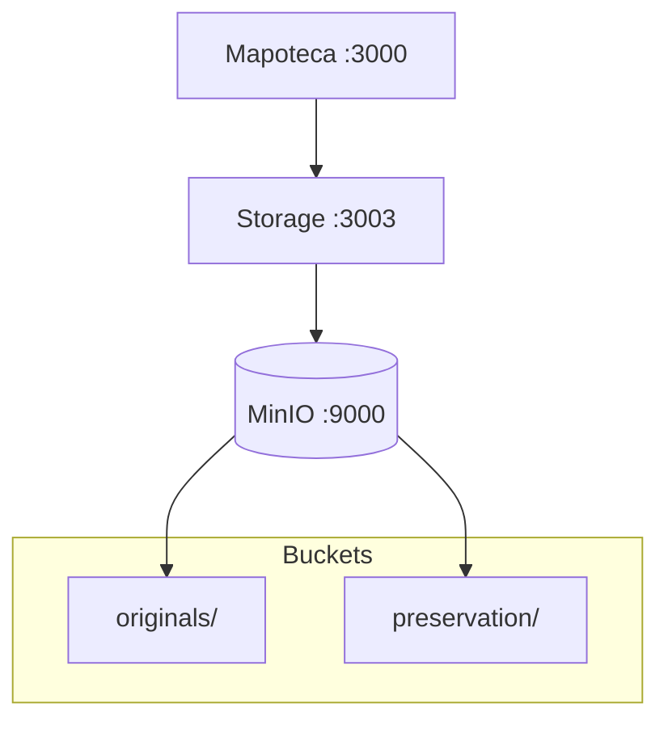
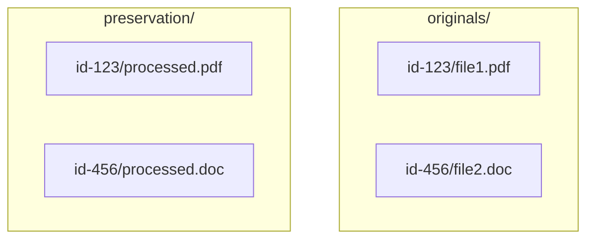

# Microsserviço MinIO

## Descrição

Armazém digital do sistema de preservação. Gerencia operações de storage no MinIO com segurança e controle centralizado.

Este microsserviço atua como intermediário entre o Mapoteca e o MinIO, fornecendo uma API REST para upload de múltiplos arquivos, geração de URLs temporárias para download, movimentação de arquivos entre buckets e obtenção de metadados. Garante que apenas o Mapoteca tenha acesso direto ao storage, centralizando o controle de segurança e auditoria.

## Características

- Upload de múltiplos arquivos (até 10, 5GB cada)
- URLs pré-assinadas temporárias (15 min)
- Movimentação de arquivos entre localizações
- Gestão automática de buckets
- Integração exclusiva com Mapoteca

## Tecnologias

- Node.js/NestJS
- TypeScript
- MinIO (S3-compatible)
- AWS SDK v3
- Docker

## Arquitetura



## Fluxos

### Upload
```
🎯 Mapoteca  💾 Storage  📦 MinIO
     │          │         │
     │─────────▶│         │
     │ 📤 files │         │
     │          │────────▶│
     │          │ 💾 store│
     │          │◀────────│
     │          │ ✅ etags│
     │◀─────────│         │
     │ ✅ paths │         │
```

### Download
```
🎯 Mapoteca  💾 Storage  📦 MinIO  🌐 User
     │          │         │        │
     │─────────▶│         │        │
     │ 📥 request│         │        │
     │          │────────▶│        │
     │          │ 🔗 sign │        │
     │          │◀────────│        │
     │          │ 📄 url  │        │
     │◀─────────│         │        │
     │ 📄 temp  │         │        │
     │──────────────────────────────▶│
     │          │         │ 📄 file│
```

### Move
```
🎯 Mapoteca  💾 Storage  📦 MinIO
     │          │         │
     │─────────▶│         │
     │ 🔄 move  │         │
     │          │────────▶│
     │          │ 📁 copy │
     │          │────────▶│
     │          │ 🗑️ delete│
     │          │◀────────│
     │          │ ✅ moved│
     │◀─────────│         │
     │ ✅ done  │         │
```

## API Endpoints

| Método | Endpoint | Descrição |
|--------|----------|-----------|
| GET | `/storage/health` | Status do serviço |
| POST | `/storage/upload` | Upload múltiplos arquivos |
| POST | `/storage/move` | Move arquivo no bucket |
| POST | `/storage/generate-url` | Gera URL temporária |
| DELETE | `/storage/file` | Remove arquivo |
| POST | `/storage/metadata` | Metadados do arquivo |

## Estrutura de Buckets



## Configuração

### Variáveis de Ambiente
```env
S3_ENDPOINT=http://minio:9000
S3_REGION=us-east-1
S3_ACCESS_KEY=minioadmin
S3_SECRET_KEY=minioadmin
MINIO_PUBLIC_URL=http://localhost:9000
PORT=3003
```

### Docker
```bash
docker-compose up -d storage_app
```

## Execução

### Desenvolvimento
```bash
npm install
npm run start:dev
```

### Produção
```bash
docker-compose up -d
```

## Monitoramento

- Health check: `GET /storage/health`
- Logs estruturados
- Interface MinIO: http://localhost:9001
- Métricas de upload/download

## Limites e Validações

- **Upload**: Máximo 10 arquivos, 5GB cada
- **URLs**: Expiram em 15 minutos
- **Acesso**: Apenas Microsserviço Mapoteca
- **Buckets**: Criação automática
- **Integridade**: Verificação via ETags